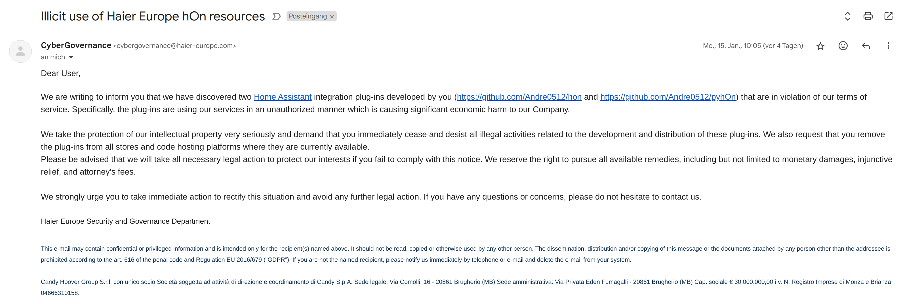
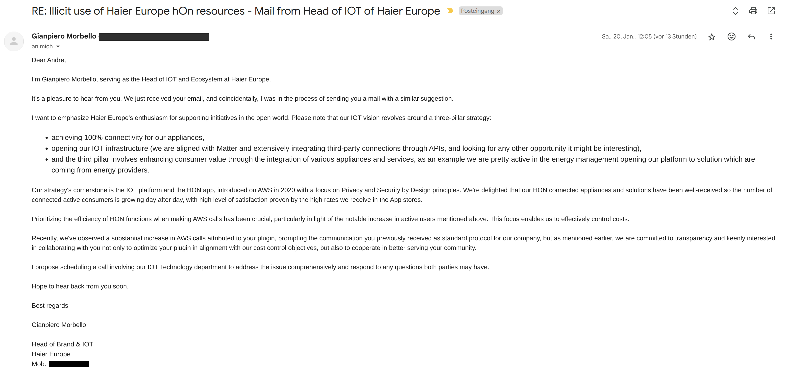

## Takedown FAQs

_Last update: 2024-01-21_

### What did Haier wrote?
Haier Europe wrote me on 2024-01-15 [this email](assets/takedown.eml):

In the course of public interest, I am taking the risk of publishing the e-mail without Haier's consent.

### Is Haier's claim true?
I think the points are very questionable, but I'm a software developer and not a lawyer or judge. So I can only try to explain here what the plugin does, but the legal assessment must be made by others.

### What did you answer Haier?
**2024-01-15**  
In the first moment of getting the mail I was absolutely shocked, I didn't think that someone cares about me and my little plugin and I know Haier is a billion dollar company, so I answered

after that i announced to take it down and then you guys happened.  
**2024-01-19**  
I'm getting so much support, and you started a huge wave, I mean we are now an example for the [Streisand effect on wikipedia](https://en.wikipedia.org/wiki/List_of_Streisand_effect_examples#By_businesses) xD    
I wrote another mail on and tried to get some clarification and reach some agreement:

### What was Haier's reaction?
**2024-01-19**  
[Haier US answered](https://www.reddit.com/r/homeassistant/comments/19a615l/haier_us_supports_home_assistant_and_open_iot/) that they have nothing to do with it and support open IOT platforms.  
Haier Europe created [a blog post](https://corporate.haier-europe.com/press-release/hon-app-a-message-about-our-iot-and-ecosystem-vision/) and said they are _committed to enhancing the smart home scenarios in line with authorized usages and intellectual property rights of Haier Europe._  
**2024-01-20**  
Gianpiero Morbello, Head of Brand & IOT Haier Europe, wrote this mail:

 
### Are you in concat with Home Assistant?
The Home Assistant team got in touch with me and will be part of a conversation with Haier.

### Did you agree to Haier's tos?
To create an account for Haier hOn you have to accept the terms of service. Without it, you can't connect your appliances to hOn and so you can't use Andre0512/hon.

### How does Haier hOn works?
Haier sells home appliances with internet connection and offers the free hOn app. As far as I can see, there is no ads, no subscription and nothing else obvious to generate money with it.  
The connection only works with the Haier servers, so your appliance sends data to the cloud and the hOn app communicates with it, there is no direct connection.

### How was the plugin created?
I used [HTTP Tookit](https://httptoolkit.com/) to monitor the HTTP requests between hOn and the Haier servers and then rebuilt the requests in Python (with aiohttp). This takes me a few days to figure out and rebuild the necessary requests and I can now also explain why the hOn app is so extremely slow. The login alone hammers ~20 requests to the servers and also the communication with the devices is made of super many requests (at least at the time of my analysis).  
The pretty complex login can be found in [auth.py](https://github.com/Andre0512/pyhOn/blob/main/pyhon/connection/auth.py) and the API requests that I have adopted as relevant for the integration are these [api.py](https://github.com/Andre0512/pyhOn/blob/main/pyhon/connection/api.py).  
Beyond that, there is no communication with the hOn servers in the code.

### Why is the plugin divided into two repositories?
**Andre0512/pyhOn**: Is a python library that I publish in the [python package index](https://pypi.org/project/pyhOn/) (pip). The library is used for communication with the Haier's hOn api.  
**Andre0512/hon**: is the integration for home assistant. This is the part that for official integrations is located in homeassistant/core. Here I have defined how the data (which is read out by pyhOn) is displayed in home assistant.   

This division is common for home assistant and hacs repositories and is helpful to include Andre0512/hon in homeassistant/core at some point.  
In my opinion, it would be much more difficult for Haier to enforce claims to Andre0512/hon. So [Mazda also only claimed the library](https://www.home-assistant.io/blog/2023/10/13/removal-of-mazda-connected-services-integration/), but without Andre0512/pyhOn, Andre0512/hon becomes useless.

### How does the plugin uses the api?
This are all requests the plugin sends to Haiers servers  

**Restart of Home Assistant or manual reload of the plugin**
- Authentication to the Haier api with the stored username and password
- Loading of all appliance functions (In [hon-test-data](https://github.com/Andre0512/hon-test-data/tree/main/test_data) you can have an overview of which data this is for each appliance)

**Status polling**
- 1 request every 5 seconds to fetch the current state for each appliance ([something like this](https://github.com/Andre0512/hon-test-data/blob/main/test_data/ac_312/appliance_data.json))

**Triggering action**
- If any action is triggerd, e.g. start some appliance or set a new a/c mode, some data have to be posted

**Creating a new releases**
- If I create a new release, program names and translations in all languages are fetched from the api and loaded to the [translation folder](https://github.com/Andre0512/hon/tree/main/custom_components/hon/translations)

### What could bother Haier?
Requesting every 5 seconds is a bit much (even if the app makes more requests more frequent, but only in use). With a poorly implemented application, this could perhaps provide some load. The default interval for most integrations is 10 seconds. I would totally understand if haier wanted a higher value here and would increase it, I have already asked them suggest a poll interval.

### Are there some secret keys stored in the repository?
There is a constant for a [client ID](https://github.com/Andre0512/pyhOn/blob/main/pyhon/const.py) and an [api key](https://github.com/Andre0512/pyhOn/blob/main/pyhon/const.py). They seems to be static because they are the same for requests from every account I saw.
The client id is necessary for doing the OAuth of the login process. The api key is to get some static data (the readable names of the programs etc) and would not necessarily be included in the release.
